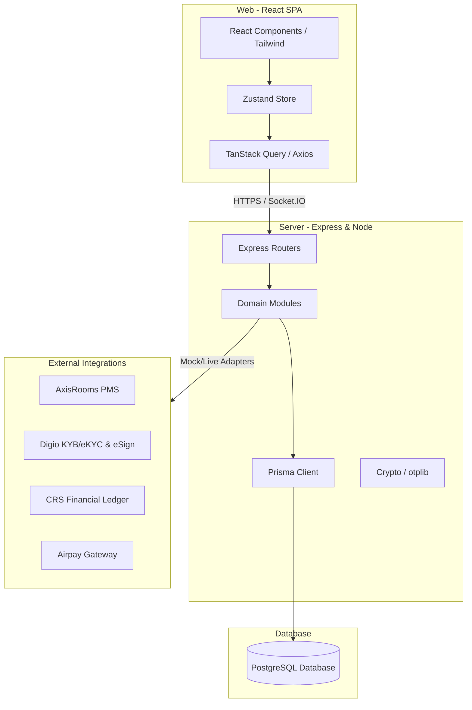

# Project Analysis Report: B2B Resort Booking Portal (v2.0 / v3.0)

This document provides a comprehensive technical and functional analysis of the B2B Resort Booking Portal project, based on the codebase, documentation (`projectScope.md`, `v2Fixes.md`, `Instructions.md`), and unit test verification.

---

## 1. System Architecture & Technology Stack

The project is structured as an **npm workspaces monorepo** with a clean separation between the frontend client and the backend server.



### Frontend (`/web`)
* **Core:** React 18, TypeScript, Vite.
* **Styling:** Tailwind CSS, PostCSS.
* **Routing:** React Router DOM (v6).
* **State Management:** Zustand (lightweight client state).
* **Data Fetching:** TanStack React Query (server state synchronization) & Axios.
* **Visualizations:** Recharts (used for admin and agency dashboards).
* **Realtime:** Socket.IO Client (for UI invalidation signals from the server).

### Backend (`/server`)
* **Core:** Node.js, Express, TypeScript.
* **Database Access:** Prisma ORM targeting PostgreSQL.
* **Authentication/Security:** JWT (Access + Refresh tokens), MFA (TOTP/Email OTP), Helmet, CORS, and Express Rate Limit.
* **File Storage:** AWS S3 (with fallback to local storage for dev/test).
* **Logging:** Winston (JSON-formatted, with correlation IDs for request tracing) + Morgan.
* **Testing:** Vitest + Supertest.

---

## 2. Domain Entities & Database Model

The database is defined in [schema.prisma](file:///d:/PARAKKAT/B2B-BookingPortal/server/prisma/schema.prisma). It maps directly to the portal's ownership boundaries:

1. **Authentication & Identity:**
   * `User`: Stores user credentials, hashed passwords, roles (`ADMIN`, `VERIFIER`, `AGENCY`, `AGENT`), sub-user access flags, and encrypted MFA secrets.
   * `RefreshToken` & `OtpCode`: Support stateless JWT cycles and two-factor authentication flows.
2. **Onboarding & Verification:**
   * `AgencyApplication`: Tracks draft details, business identifiers (GSTIN, PAN), authorized representative data, bank info, and lifecycle states (`DRAFT` to `ACTIVE`).
   * `Verification`: Records individual check statuses (`GST`, `PAN`, `AADHAAR_EKYC`, `BANK`, `DOCUMENT`, `ESIGN`) and payloads from Digio.
   * `Document`: Securely holds storage keys and checksums of uploaded files (incorporation proofs, address proofs, and signed agreements).
3. **Core B2B Operations:**
   * `Agency`: Represents activated business partners.
   * `CommercialConfiguration`: Maintains versioned settings for markups, payment modes (`PREPAY` / `CREDIT`), credit limits, and payment terms.
   * `Booking`: Tracks bookings made by agents. Stores both the `baseRate` and the computed `agencyPrice` to keep invoices reproducible if agency-level markups change.
   * `RoomTypePricing`: Configures portal-managed pricing overrides, base occupancies, and child charge age bands.
   * `RatePlanRate`: Configures meal-inclusive pricing presets (EP, CP, MAP, AP) and date-range versions for the Rate Calendar.
   * `ChannelPolicy`: Enforces availability caps or stop-sells for the B2B channel.
   * `Allotment`: Reserves blocks of rooms for specific agencies.
4. **Finance & External Synchronization:**
   * `Invoice`: Stores taxable amounts, tax splits (CGST, SGST, IGST), and IRP-stamped IRNs (Invoice Reference Numbers).
   * `CreditNote`: Supports GST-compliant partial/full cancellation adjustments.
   * `Payment`: Logs transaction statuses (`PENDING`, `SUCCEEDED`, `FAILED`, `CHARGEBACK`) and payment gateway references.
   * `CrsOutboxEvent`: Implements the transactional outbox pattern to forward financial records to the company CRS.
   * `RebookTask`: Queues bookings that were paid but failed to push to the PMS due to temporary outages.

---

## 3. Core Business Modules & Logic

### 3.1 Agency Onboarding Lifecycle (State Machine)
Every agency application moves through a rigorous state machine governed by [lifecycle.machine.ts](file:///d:/PARAKKAT/B2B-BookingPortal/server/src/modules/lifecycle/lifecycle.machine.ts):

* **Draft:** The applicant saves registration details and uploads documents. Resumable via a secure token.
* **Verification:** Automatic and manual Digio checks execute.
* **Review:** Verifiers review details.
* **Approved:** Verifier approves; application is ready for commercial setup.
* **Commercial Configuration:** Admin defines the payment mode, credit limit, payment terms, and markup percentage. The system generates the agreement for e-signing.
* **Active:** The representative signs the agreement via Digio Aadhaar eSign. The system creates the `Agency` record, generates credentials, and allows bookings.

### 3.2 The Unified Credit Gate
Instead of splitting logic between prepay and credit accounts, all bookings route through a single, well-tested gate in [creditGate.ts](file:///d:/PARAKKAT/B2B-BookingPortal/server/src/modules/booking/creditGate.ts):

$$\text{Outstanding Balance} + \text{Booking Agency Price} \le \text{Effective Credit Limit}$$

* **Prepay Agency:** Effective credit limit is forced to ₹0, automatically redirecting them to the payment gateway path (`pay_first`).
* **Credit Agency (Within Limit):** Stays in `confirm_on_credit` and commits immediately.
* **Credit Agency (Over Limit):** Falls back to the `pay_first` branch (Decision D3).
* **Tentative Holds:** For the `pay_first` path, a local hold with a TTL (e.g., 15 minutes) is created. The booking is pushed to AxisRooms **only** after payment clears.

### 3.3 Dynamic Room Pricing Composition
Rates are calculated dynamically on the server based on:
$$\text{Room Charge} = \text{Rate-Plan Rate} + \sum \text{Extra-Adult} + \sum \text{Child Charges} + \text{Extra-Bed Charge}$$
$$\text{Agency Price} = \text{Room Charge} \times (1 + \text{Agency Markup}\%)$$
This composition ensures changes to baseline tariffs or meal packages are accurately marked up and verified server-side.

### 3.4 GST Tax Compliance (India)
The invoicing engine handles:
* **Tax slabs based on transaction value:** 0% (up to ₹1,000), 5% (₹1,001 to ₹7,500), and 18% (above ₹7,500).
* **Place of Supply Tax Splitting:** Compares the resort location against the agency's registered state to apply either CGST + SGST (intra-state) or IGST (inter-state).
* **E-invoicing:** Provision for generating and attaching IRNs (Invoice Reference Numbers) and QR codes via IRP APIs for compliance.

---

## 4. Current Implementation & Testing State

### Unit Tests
The unit test suite validates isolated system components (auth, cryptography, rate validation, schemas, and templates) without database requirements.
* **Command:** `npm run test:unit --workspace server`
* **Result:** **111 / 111 tests passed successfully**.

```
 ✓ tests/unit/middleware/rbac.test.ts (20 tests)
 ✓ tests/unit/onboarding/onboarding.schema.test.ts (8 tests)
 ✓ tests/unit/commercial/commercial.mapping.test.ts (6 tests)
 ✓ tests/unit/lifecycle/lifecycle.machine.test.ts (8 tests)
 ✓ tests/unit/notifications/templates.test.ts (4 tests)
 ✓ tests/unit/auth/token.service.test.ts (4 tests)
 ✓ tests/unit/booking/creditGate.test.ts (5 tests)
 ✓ tests/unit/auth/mfa.service.test.ts (4 tests)
 ✓ tests/unit/verification/progression.test.ts (6 tests)
 ✓ tests/unit/finance/cancellation.test.ts (5 tests)
 ✓ tests/unit/utils/crypto.test.ts (5 tests)
 ✓ tests/unit/lib/storage.test.ts (3 tests)
 ✓ tests/unit/digio/signature.test.ts (5 tests)
 ✓ tests/unit/booking/pricing.test.ts (6 tests)
 ✓ tests/unit/config/boolEnv.test.ts (3 tests)
 ✓ tests/unit/digio/mockDigio.test.ts (2 tests)
 ✓ tests/unit/lib/mailer.test.ts (2 tests)
 ✓ tests/unit/utils/mask.test.ts (6 tests)
 ✓ tests/unit/onboarding/anomaly.test.ts (3 tests)
 ✓ tests/unit/commercial/tiers.test.ts (4 tests)
 ✓ tests/unit/auth/password.service.test.ts (2 tests)
```

### Integration Tests
The integration tests (`tests/integration/*.test.ts`) are fully written to execute end-to-end flows, including webhook signature validation, lifecycle progression, database rollbacks, and dunning rules. 
* **Current Status:** These tests are currently failing locally because they require an active PostgreSQL instance on `localhost:5432` to connect to and truncate.
* **Prerequisite for Execution:** As described in [RUNBOOK.md](file:///d:/PARAKKAT/B2B-BookingPortal/docs/RUNBOOK.md), a database must be provisioned and migrated against `.env.test` (`npm run db:migrate:deploy --workspace server`) before running `npm run test`.

---

## 5. Risk Analysis & Open Decisions

The following table summarizes open decisions from `v2Fixes.md` that must be verified before proceeding to final validation or deployment:

| Decision | Area | Summary of Resolution / Risk |
|---|---|---|
| **D6** | **AxisRooms write capability** | **CRITICAL RISK:** We must verify in writing that AxisRooms supports reservation write/push (and not just read-only queries). If it is read-only, the booking commit flow (§5) must be redesigned. |
| **D1** | Base-rate source | Closed to **(b) Portal-managed**. Enables the rate calendar. |
| **D4** | Cancellation policy | Starting proposed model: Free >7 days, 50% charge 48h–7d, 100% charge <48h. Requires CEO-office approval. |
| **D10** | Markup application | Single-markup-on-total room charge (default) vs. per-component markup. |
| **D11** | Commit failure resolution | Standard auto-refund or redirection to an admin rebook queue if AxisRooms commits fail post-payment. |

---

## 6. Recommendations & Next Steps

1. **Confirm AxisRooms API Write Operations (D6):** Ensure integration endpoints are accessible in writing before executing live testing.
2. **Setup Test Database:** Spin up a temporary local Postgres container or a managed test schema to run the integration tests (`tests/integration/`).
3. **Register WhatsApp Templates:** WhatsApp is defined as a primary operational channel in v3.0. Meta Business Manager templates must be submitted for approval early to avoid delays.
4. **MFA Enforcements:** While demo accounts bypass MFA, Ensure TOTP is strictly verified for all `ADMIN` and `VERIFIER` roles in production staging.
5. **Secure Document Storage:** Verify that the S3 storage adapter config is operational under `STORAGE_PROVIDER=s3` for non-development environments, avoiding local disk retention of PII.
